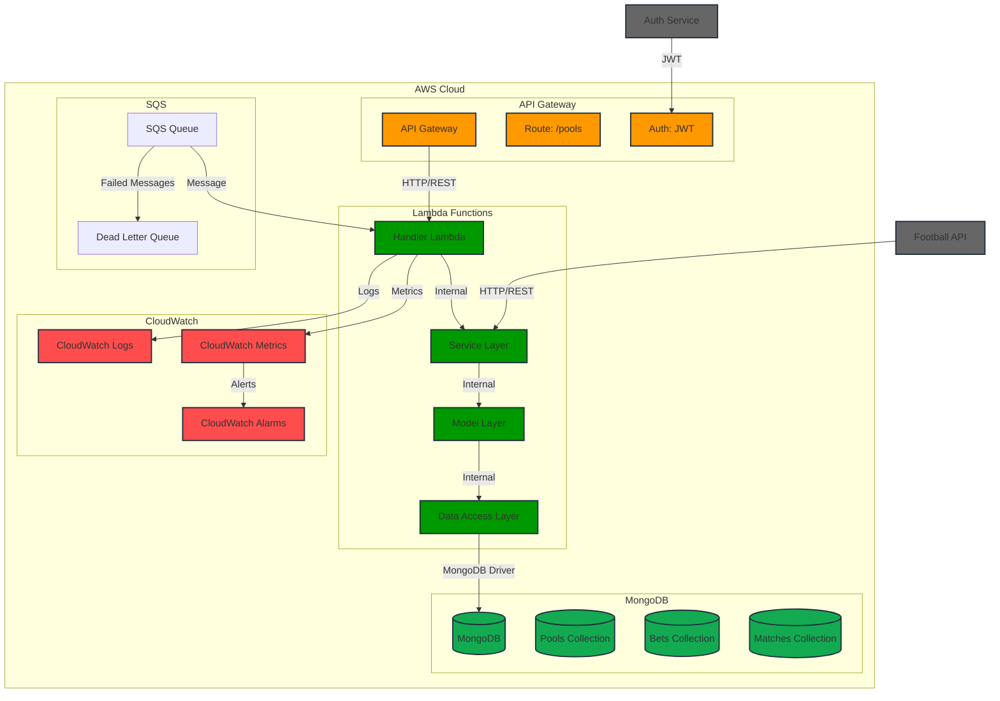

# System Architecture

## Overview

The Create Bets Bolão service is a serverless application built with AWS Lambda and Serverless Framework. It provides functionality for creating and managing betting pools, processing user bets, and calculating results.

## Architecture Diagram

## System Layers

### 1. API Layer (api/)
- Responsible for external service integration
- Implements communication with the football API
- Manages authentication and HTTP requests

### 2. Data Access Layer (data-access/)
- Manages MongoDB connection
- Implements CRUD operations in the database
- Abstracts data access complexity

### 3. Model Layer (model/)
- Defines data structure
- Implements basic business rules and validations
- Creates dynamic models based on pool ID

### 4. Service Layer (service/)
- Implements main business logic
- Calculates scores and weights per round
- Manages pool-specific rules

### 5. Handler Layer (handler.js)
- Lambda function entry point
- Processes HTTP events
- Coordinates flow between different layers

## Data Flow
1. HTTP request received by Lambda
2. Handler processes event and extracts parameters
3. Service layer coordinates business logic
4. Data Access layer persists data
5. Response is returned to client

## Security Considerations
- Credentials stored in environment variables
- Input data validation
- Error and exception handling
- Audit logs

## Scalability
- Serverless architecture enables automatic scaling
- MongoDB connections managed efficiently
- Asynchronous bet processing 